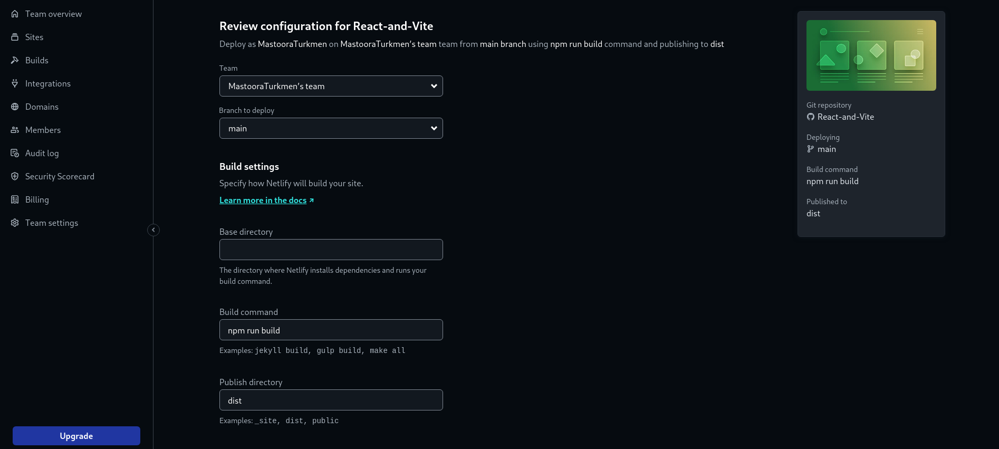
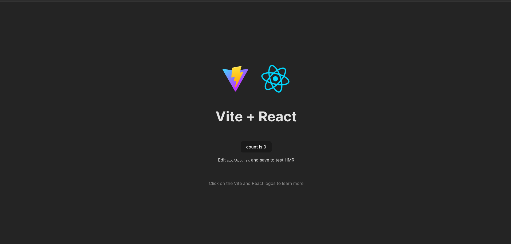

# React + Vite

https://react-and-vite-site.netlify.app/

This template provides a minimal setup to get React working in Vite with HMR and some ESLint rules.

Currently, two official plugins are available:

- [@vitejs/plugin-react](https://github.com/vitejs/vite-plugin-react/blob/main/packages/plugin-react/README.md) uses [Babel](https://babeljs.io/) for Fast Refresh
- [@vitejs/plugin-react-swc](https://github.com/vitejs/vite-plugin-react-swc) uses [SWC](https://swc.rs/) for Fast Refresh


## Before you Begin 🛠 🔨

Write the following command in your terminal

```
$ npm install
$ npm run dev
```

```
$ pnpm install
$ pnpm run dev
```


## For cloning the project 🪛

```
# Clone this repository
$ gh repo clone MastooraTurkmen/React-and-Vite

# Go inside the repository
$ cd react-and-vite

```


## Deployment 📪 

+ **How to deploy our project to netlify site?**
  + **I use [Netlify App](https://app.netlify.com/) for deploying my projects.**
  + **Go to Netlify site and select Add a new site.**
  + **From there select _Deploy with Github_**
  + **Then write your project name and select it**
  + **After selecting here you can see that the project _Review configuration for Reat-And-Vite_ and then select the _Deploy Reat-And-Vite_ Button**
     
  + **Now your project is Live**

-----


## The React And Vite Screenshots


+ **You also can Count here**
